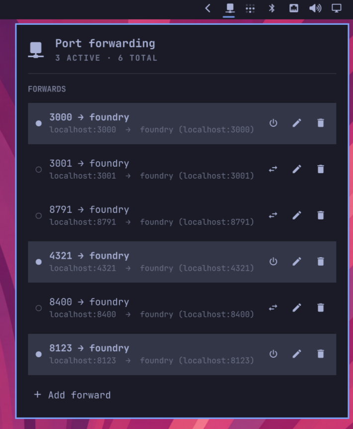

# Port Forwarding — Omarchy bar widget

A little bar widget for managing SSH port forwards without keeping a terminal
open. Define forwards once, then flip them on/off from the bar.



## Install

```
omarchy plugin add https://github.com/omacom-io/omarchy-port-forward-plugin.git --enable
```

Enable/disable later, or remove entirely, with:

```
omarchy plugin enable port-forward --section right
omarchy plugin disable port-forward
omarchy plugin remove port-forward
```

Each tunnel runs inside a **transient systemd user service**
(`omarchy-pf-<id>.service`, launched with `systemd-run --user`), not as a child
of the shell. That means a tunnel **survives a shell reload or crash** — and on
startup the widget reconciles its state against systemd, so a tunnel that
outlived the shell is picked back up as "active" instead of being orphaned and
colliding with a retry. No `ssh -L …` terminal to babysit.

## What it does

- Shows the number of active tunnels in the bar (glyph brightens + a count badge).
- Left-click opens a keyboard-friendly panel listing every forward with a live
  status dot: `○` off, `◐` connecting, `◉` approval needed, `●` on, `✕` error.
- Turn a forward on/off, edit its destination, or delete it — all inline.
- **Bounce a local port between hosts:** turning on a forward automatically
  turns off any other active forward bound to the same local port, so switching
  `3000 → foundry` to `3000 → staging` is one click with no bind clash.
- "Active" is only shown once the local port is actually listening, so a host
  stuck connecting is never mislabelled as up.

Each forward is: an optional label, a local port, an SSH host (any name from
`~/.ssh/config`, or `user@host`), a remote bind host (default `localhost`), a
remote port, an optional autostart flag, and optional extra `ssh` options
(e.g. `-J bastion`). Extra options are split on whitespace — an option that
needs embedded spaces (like a quoted `ProxyCommand`) belongs in
`~/.ssh/config` instead.

The underlying command is:

```
ssh -N -T -o BatchMode=yes -o ExitOnForwardFailure=yes \
    -o ServerAliveInterval=30 -o ServerAliveCountMax=3 -o ConnectTimeout=10 \
    -L <localPort>:<remoteHost>:<remotePort> [extra opts] <sshTarget>
```

`BatchMode=yes` means auth must be non-interactive (SSH key / agent) — the same
setup that lets `ssh <host>` work without a password prompt.

## When SSH needs *you* (Tailscale checks, host keys)

Some connections stall on a step only a human can do. The widget detects both
cases from the unit's journal and surfaces them instead of sitting on
"connecting" forever:

- **Tailscale SSH check mode** — the server prints
  `To authenticate, visit: https://login.tailscale.com/…` and waits. The row
  flips to `◉` "Approval required", the bar icon turns urgent, and clicking the
  row (or its key button) opens the approval page in your browser. Once you
  approve, ssh proceeds on its own and the row goes `●` active on the next
  poll — no restart needed.
- **Unknown host key** — `BatchMode` makes ssh fail fast with
  "Host key verification failed". The row shows the error plus a key button:
  **Trust host key & retry**, which reruns the tunnel once with
  `-o StrictHostKeyChecking=accept-new` (records the new key, then connects).
- **Changed host key** — never auto-trusted. The row warns
  "Host key CHANGED — possible MITM; verify and fix ~/.ssh/known_hosts" and
  offers no shortcut, on purpose.

## Keyboard shortcuts (panel open)

- `j` / `k` or `↑` / `↓` — move the cursor (the last row is "Add forward")
- `enter` / `space` — toggle the selected forward on/off (or open the add form)
- `a` — add a forward
- `e` — edit the selected forward
- `x` — delete the selected forward (with confirmation)
- `r` — reload from disk
- `esc` — close

## Where state lives

Forward definitions are stored in `~/.config/omarchy/port-forwards.json`
(watched, so hand-edits show up live). Which tunnels are currently running is
owned by **systemd** — the widget polls `systemctl --user is-active` (plus an
`ss` check that the local port is really listening) and reconciles on startup,
so systemd is the single source of truth for liveness. Set `autostart: true` on
a forward to bring it up when the shell first starts (it won't double-start one
that's already running from a previous session).

Manage the units directly if you ever need to:

```
systemctl --user list-units 'omarchy-pf-*'
systemctl --user stop omarchy-pf-<id>
journalctl --user -u omarchy-pf-<id>
```

## Requirements

- `ssh` on `PATH` (OpenSSH client)
- systemd user session (`systemd-run --user`, `systemctl --user`, `journalctl`)
- `ss` (iproute2) for the "is the port listening yet" readiness check
- Non-interactive SSH auth to your hosts (key + agent)

Because tunnels run as systemd user units, ssh sees the *user manager's*
environment, not your terminal's — `SSH_AUTH_SOCK` must be imported there for
agent auth to work. Omarchy sessions (uwsm) already do this; on a session that
doesn't, run `systemctl --user import-environment SSH_AUTH_SOCK`.

## IPC (scriptable from a keybind)

```
omarchy-shell port-forward open
omarchy-shell port-forward list
omarchy-shell port-forward statuses
omarchy-shell port-forward on <id|label|localPort>
omarchy-shell port-forward off <id|label|localPort>
omarchy-shell port-forward toggleForward <id|label|localPort>
```

`on` is "ensure running": it leaves an already-active tunnel alone.
`toggleForward` flips it either way.

## Files

- `manifest.json` — plugin manifest (`kind: bar-widget`, entry `Panel.qml`)
- `Panel.qml` — bar button + popup panel, list rows, add/edit form, keyboard nav
- `Service.qml` — systemd unit lifecycle, status polling/reconcile, JSON persistence
